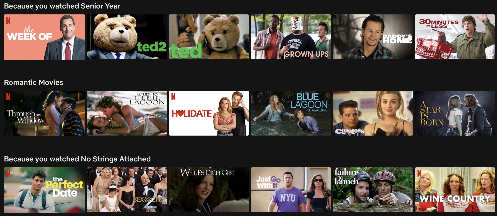
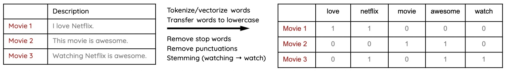
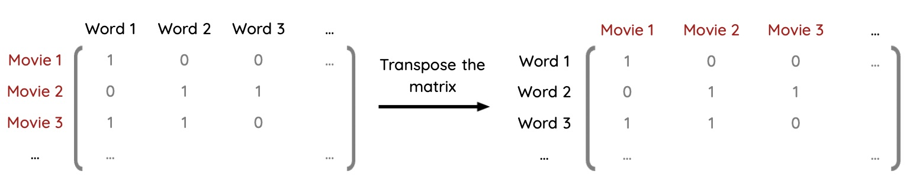
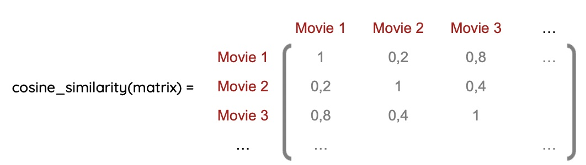
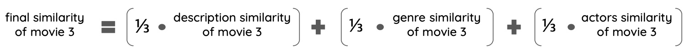
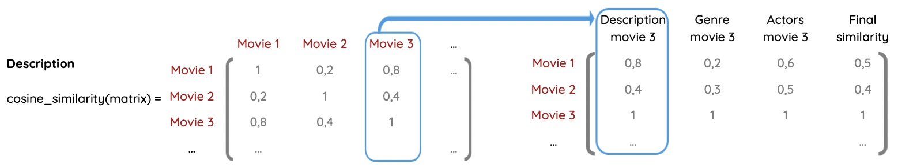
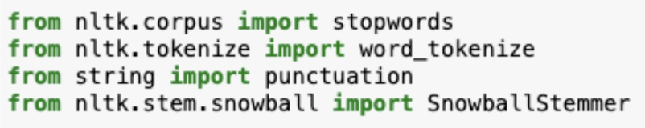
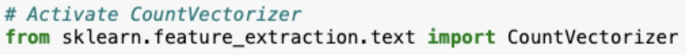
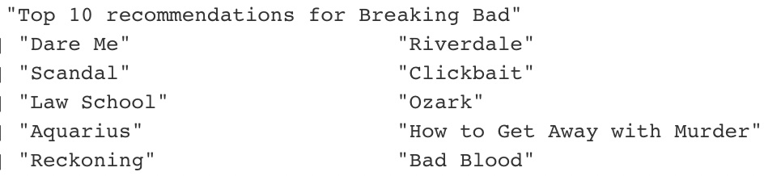

\newpage

# Content-Based Recommendation System

```{r, echo=FALSE, message=FALSE, warning=FALSE, fig.align="center", out.width = "100%"}

```

Though Netflix offers many movies, it has a great recommendation system customized for every viewer (otherwise, we would probably be overwhelmed). So let's get to the bottom of this system and build your personalized system!

There are two different recommendation systems: collaborative and content-based, but we focused on the content-based recommendation system because of its simplicity. What does that mean?
It means that you will build a recommendation system based on your previous viewing history and recommend movies/shows with similar "content." So your content-based recommendation will base on the description, genre, and actors column.

Before you start coding you should first check out the theory behind a content-based recommendation system.


## Theory

One of your questions probably is "How can I calculate the similarity between two movies regarding the description/genre/actors?" You will calculate the similarity of movies/shows with the cosine similarity function, but we will get to that later. The hard work will be the preparation to use the cosine similarity function.

We will walk you through the theory by looking at the description column. The approach for the genre and cast columns are very similar, so don't worry!

To calculate the similarity between two movies/shows regarding the description, you need to first prep the column. Therefore, you need to collect all words used in the entire description column, generate new columns with each word as titles, and fill in the cells for each movie/show with 1's if the word appears or 0's if it doesn’t appear. In the below chart, you can see what we mean :)

```{r, echo=FALSE, message=FALSE, warning=FALSE, fig.align="center", out.width = "100%"}

```

The matrix on the right hand side is called a **“Document Term Matrix”**.

Now let us explain what all these words above and underneath the arrow mean. "Tokenize/vectorize words" means each word has its column.
"Transfer words to lowercase" is helpful since the same words should not be in two different columns just because one word has a capital letter and the other a lowercase. The next step is to remove stop words and punctuation since that is irrelevant to the similarity matrix. At last, you should also consider the stemming of each word to reduce verbs like waiting, waits, waited, etc. to wait. Maybe you should also only consider words that appear more often than once (50-100 times) to reduce the size of your data frame. 

FYI: this method is called **bag of words** :)

If you are in the R track then please read the following section. Python coders can skip this part.

Before we can calculate the cosine similarity matrix, you first need to transpose the matrix. What does that mean? You have to switch the rows to columns and the other way around. We have visualized the idea below. (If you don’t transpose the matrix, you will calculate the similarity between each word instead of each movie.)

```{r, echo=FALSE, message=FALSE, warning=FALSE, fig.align="center", out.width = "100%"}

```

Now let’s check out that scary word "cosine similarity." In our case, it calculates the similarity between two items (movies/shows) based on the description column. Mathematical speaking, "it measures the cosine of the angle between two vectors projected in a multi-dimensional space." If you are further interested in the mathematical idea/function, you can check out this [website](https://www.sciencedirect.com/topics/computer-science/cosine-similarity). 
Though, this is not necessary for you to build the recommendation engine since R and Python provide packages for that function ;)

The matrix below shows how the output should look like. If two movies/shows are identical, they have the value 1, and with no similarities, the value 0.

```{r, echo=FALSE, message=FALSE, warning=FALSE, fig.align="center", out.width = "70%"}

```

So, in this case, movie 1 and 3 have the highest similarity (the identical movies have, of course, the value 1, but they aren't interesting since we want a recommendation system with new movies). In contrast, movie 1 and 2 have the lowest similarity.
Now you have to repeat the steps above for genre and actors so that you have 3 cosine similarity matrices.

At this point,  you completed the data preparation, and you can continue with the actual recommendation of some movies. The goal is to print 10 recommendations from the 5 previous movies you have watched. 

For example, movie 3 was the last movie you watched. Now you need to build a data frame/matrix where all movies are in the rows, and the column from movie 3 of the similarity matrices of description/genre/actors are in each column. After that, you need to generate a final column where you weigh each similarity component for the final similarity value of each movie. 
For example, if you say that description, genre and actors are all equally important to you, then you can choose for each a 1/3 share: 

```{r, echo=FALSE, message=FALSE, warning=FALSE, fig.align="center", out.width = "100%"}

```

You can see in the below graph what we mean :)

```{r, echo=FALSE, message=FALSE, warning=FALSE, fig.align="center", out.width = "100%"}

```

In this case, movie 1 has a higher similarity than movie 2 regarding movie 3, so your recommendation would be to watch movie 1. 
That's the theory behind the content-based recommendation system (yeah!). 
Phew, that was a lot! If you have any questions, please ask your mentor; they are happy to help you! 

If not, let’s get ready to rumble!


## Bag of words

As mentioned in the theory chapter, you need to extract all words from the description/genre/cast column with the bag of words approach. We suggest starting with the description, continuing with the genres, and ending with the actors. 

Below you can see the example for the description column.

```{r, echo=FALSE, message=FALSE, warning=FALSE, fig.align="center", out.width = "100%"}

```

### Creating a corpus

Before you start, you first need to create a corpus to vectorize the words in each column.

::: {.tips .r data-latex="r"}
We recommend using the tm and SnowballC packages. Check out this [website](https://thibaut-deveraux.medium.com/how-to-create-a-bag-of-words-embedding-in-r-e609095ebf53). This article gets interesting/relevant, starting with the title “Create the bag of words.”
:::

::: {.tipsp .python data-latex="p"}
Since there is not a package that reliably builds a term document matrix, which is applicable to a recommendation system, you have to build it on your own. Sounds really challenging and it is kinda true. It is comparable to the steps that are done by the function in R (look tipp above). The most important functions used are here:
```{r, echo=FALSE, message=FALSE, warning=FALSE, fig.align="center", out.width = "60%"}

```
Where you have to apply those is in your hands. 
For the data preparations we would recommend using **lambda functions**. There are some necessary changes to the dataframes to work with it in later steps. :)
:::


### Document Term Matrix

Since you have created a corpus, you can build a document term matrix (which is on the right side of the above chart). 
For that, you should consider transferring the words to lowercase, removing stop words and punctuation, and regard the stemming of each word to reduce verbs like waiting, waits, waited, etc. to wait.

::: {.tips .r data-latex="r"}
Continue reading the [article](https://thibaut-deveraux.medium.com/how-to-create-a-bag-of-words-embedding-in-r-e609095ebf53) at “Document term matrix for words“. 
It explains how to create a document term matrix by editing the words mentioned above. 
(You can ignore the part about the weighting function TfIdf since we don’t consider that for simplicity reasons.)
:::

::: {.tipsp .python data-latex="p"}
Again at this point this function might be helpful:
```{r, echo=FALSE, message=FALSE, warning=FALSE, fig.align="center", out.width = "80%"}

```
You can use this function on all columns that are relevant for you. After that you can fit a matrix on this column. You still have to rename some stuff after that, but we leave that to you. 
:::


## Cosine Similarity

Let’s move forward to the cosine similarity matrix! Remember, you need 3 matrices for description, genre, and actors. Below you can see what your output should look like.

```{r, echo=FALSE, message=FALSE, warning=FALSE, fig.align="center", out.width = "70%"}

```

### Preparation for *R* only

Before you can start using the cosine similarity function, you first need to transform the document term matrix to a matrix to transpose it (so that the movie titles are in the column and the words represented in the rows.) If you have completed that, you can continue with transposing the matrix.

```{r, echo=FALSE, message=FALSE, warning=FALSE, fig.align="center", out.width = "100%"}

```

After transposing the matrix, you can add the title names in the columns if you haven't done that before.

::: {.tips .r data-latex="r"}
You can transpose the matrix with the basic R package, so you don’t need to install anything further.
:::

::: {.tipsp .python data-latex="p"}
Transposition of the matrix is not needed in Python. You can simply use the cosine similarity in the sklearn library. But you should be aware of the index, columns  and data type after using it.
:::


### Function

Now you should be able to use the function for the description, genre and actors column :)

::: {.tips .r data-latex="r"}
For the cosine similarity function, you can use the lsa package. 
Don’t worry if the function takes a few minutes to calculate; it is a large matrix, so it’s only normal that the performance isn’t the best. 
After calculating the cosine similarity function, you might want to transform it into a data frame to continue working with tidyverse.
:::

::: {.tipsp .python data-latex="p"}
In Python you have to do all the steps for every column you use for the recommendation separately. For some columns you have to use the functions in a slightly different way.
:::

## Recommendations

You are almost there, so don’t give up! Before you start coding your final part for the content-based recommendation, have a look at how the output could look like.
So in our example, Tobis last watched movie/show was Breaking Bad, and as recommendations, we got:

```{r, echo=FALSE, message=FALSE, warning=FALSE, fig.align="center", out.width = "80%"}

```

There are some very interesting recommendations, but most of them make sense, so it worked! Now it’s your turn!

One of the challenges is that not every public data set might include your last-watched movie/show. 
That is why we worked with a simple for loop, which iterates over your last seen movies/shows and first checks if the public data set includes that movie/show, and if so, you can build your data frame as mentioned in theory:

```{r, echo=FALSE, message=FALSE, warning=FALSE, fig.align="center", out.width = "100%"}

```

So you take out of each similarity matrix (description/genre/actors) the column of your last seen movie and create a final similarity column. As already mentioned, you can weigh the aspects (description/genre/actors) differently and check what happens to your recommendations.

For example, if you say that description, genre and actors are all equally important to you, then you can choose for each a 1/3 share: 

```{r, echo=FALSE, message=FALSE, warning=FALSE, fig.align="center", out.width = "100%"}

```

For instance: I have looked at recommendations for “Inception,” and one of them was “Lord of the Rings,” but once I changed my priorities/weighting, that recommendation changed.

If the public data set doesn't include your last-watched movie/show, your loop should move on to the next movie/show you have watched.

Since you only want to print recommendations for 5 movies/shows, you also need to define that your loop stops after movie/show number 5. Don’t forget to sort your data frame based on the final similarity column since you want recommendations with the highest similarity.


Voilà! You got yourself a self-built content-based recommendation system!


**Congratulations!** You’ve made it to the end of your TechAcademy Data Science project. After visualizing the data in the first part, you’ve also set up your personal content-based recommendation system in this section. If you stuck around until this part and managed to code the better part of the exercises, you have definitely earned your certificate! We hope you had fun learning Data Science with this combination of data sets and enjoyed it – at least the parts where you did not get stuck forever because of some unexplainable coding error. Do not forget to send your project results to our project submission email address before the deadline (**05.02.2023, 23:59**).
Thank you for being a part of TechAcademy!
